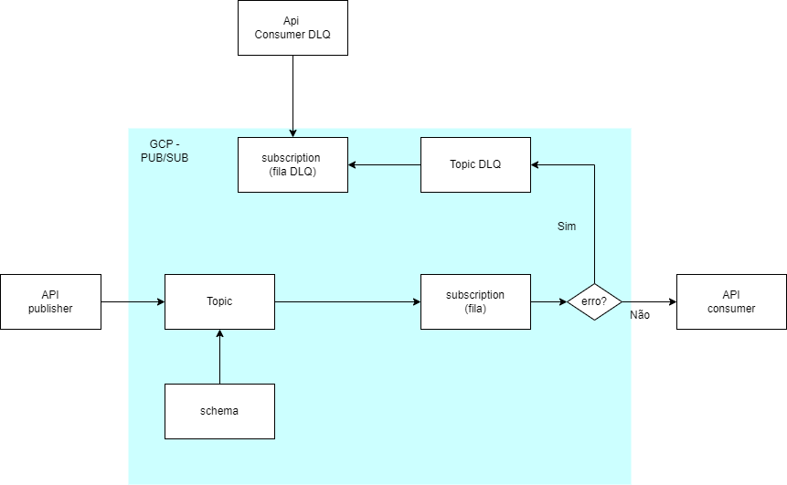

# app-pubsub

### Diagrama

 

### Comportamento esperado:

- Mensagem enviada pelo publisher é processada pelo tópico e enviada para fila
- A fila faz um push para a API consumer
- De acordo com o valor do campo isHuman a api aceita ou recusa a mensagem
- **true**: aceita **false**: recusa
- Mensagens recusadas são enviadas ao tópico DLQ 
- Mensagens DLQ's ficam na fila (pull) até serem lidas pelo consumer dlq
- Uma vez lidas as mensagens são **deletadas do storage** pub/sub

### Ambiente de execução
- Executado em Máquina Virtual na Cloud Google
- Subscription consumer envia via push no http://ipVM:8002/receive
- O firewall da VM precisa ter liberada ingress/egress as portas
    - 8001
    - 8002
    - 8003 
